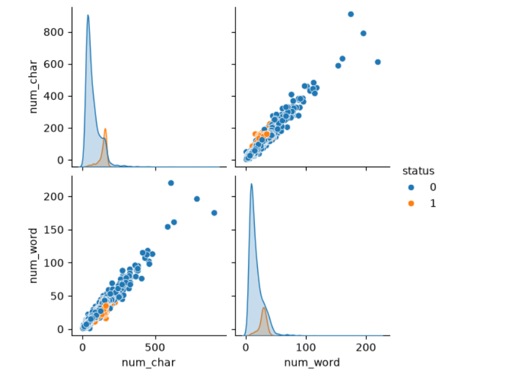
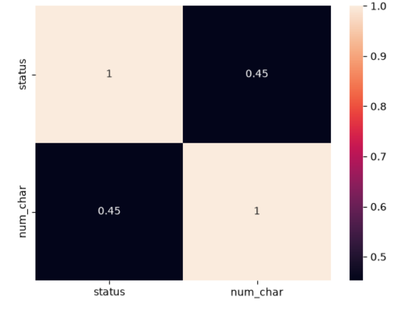
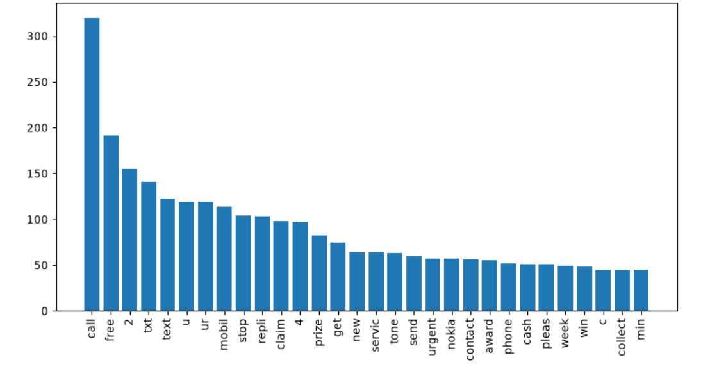
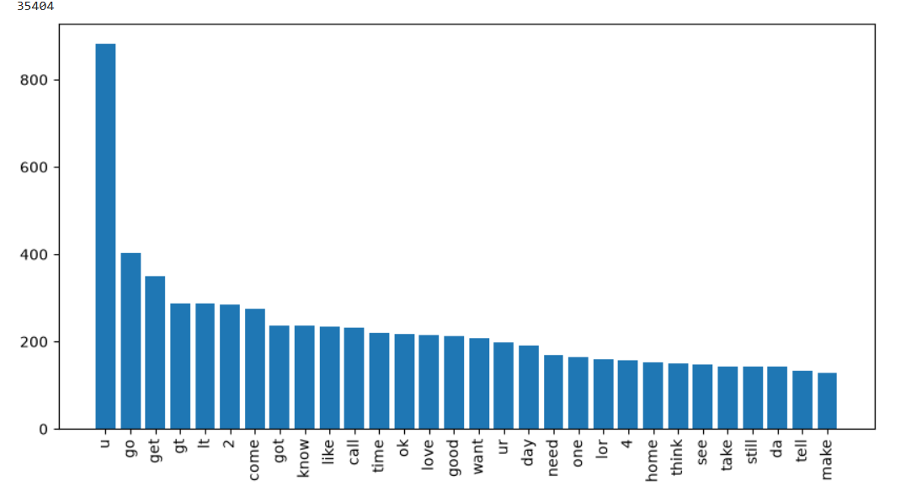

# SMS Spam Detection

A machine-learning classifier that reads an SMS message and predicts whether it's **Spam** or **Ham** (legitimate).

> **Design constraint:** a real message must never be flagged as spam. A missed spam message is a minor annoyance, but a genuine message wrongly blocked is unacceptable — so the model was chosen to maximize **precision** on the spam class, not just accuracy.

---

## Dataset

- Source: `spam.csv` (`latin-1` encoding)
- Raw shape: **5,572 rows x 5 columns** — `v1` (label), `v2` (message text), plus 3 mostly-empty `Unnamed` columns
- Cleaning steps:
  - Dropped the 3 `Unnamed` columns (only 50 / 12 / 6 non-null values — mostly noise)
  - Renamed `v1` → `status` (target label)
  - Removed **403 duplicate rows** (kept first occurrence)
  - Label-encoded target: `ham → 0`, `spam → 1`
- Class balance is imbalanced — far more ham than spam — another reason precision was prioritized over raw accuracy.

## Feature Engineering

Two length-based features were computed directly from the raw text for EDA:
- `num_char` — character count
- `num_word` — token count (`nltk.word_tokenize`)

Text pre-processing pipeline applied before vectorization:
1. Lower-case the message
2. Tokenize (`nltk.word_tokenize`)
3. Keep only alphanumeric tokens (drop punctuation/symbols/emojis)
4. Remove English stopwords (`nltk.corpus.stopwords`)
5. Stem every remaining word with `PorterStemmer` (e.g. *winning*, *wins* → *win*)

The cleaned, stemmed text is what the model was actually trained on.

## Exploratory Data Analysis

**Message length vs. class** — spam messages are consistently longer than ham messages.



**Correlation** between message length and label — a moderate positive correlation (0.45) confirms longer messages skew spam.



**Most frequent words in spam** — dominated by promotional/transactional vocabulary (`call`, `free`, `txt`, `claim`, `prize`, `urgent`, `mobil`), which is exactly what a bag-of-words model can key on.



**Most frequent words in ham** — everyday conversational language, very different from spam's vocabulary.



## Vectorization

Text was converted to numeric features using **`CountVectorizer`** (bag-of-words, 6,708 features). `TfidfVectorizer` (max 3,000 features) was also tested but `CountVectorizer` gave the strongest downstream results and was used for the final model.

## Model Comparison

Data split 80/20 (`train_test_split`, `random_state=42`). Nine algorithms were compared on accuracy and precision:

| Algorithm | Accuracy | Precision |
|---|---|---|
| SVC | 93.23% | 77.37% |
| KNN | 90.43% | **100.00%** |
| Multinomial Naive Bayes | 97.39% | 88.82% |
| Decision Tree | 92.36% | 92.31% |
| Logistic Regression | 97.10% | 94.57% |
| **Random Forest** | **96.71%** | **100.00%** |
| AdaBoost | 90.72% | 86.57% |
| Gradient Boosting | 93.42% | 88.12% |
| XGBoost | 97.00% | 94.53% |

Two models hit perfect precision (KNN, Random Forest) — meaning neither ever misclassified a genuine ham message as spam. **Random Forest** was chosen since it has far higher accuracy and recall (96.71% vs. 90.43%).

## Selected Model: Random Forest

```python
RandomForestClassifier(n_estimators=50, random_state=2)
```

Trained on 6,708 CountVectorizer features from 4,135 training messages (3,627 ham, 508 spam).

**Classification report** (test set, n = 1,034):

| Class | Precision | Recall | F1-score | Support |
|---|---|---|---|---|
| Ham (0) | 0.96 | 1.00 | 0.98 | 889 |
| Spam (1) | **1.00** | 0.77 | 0.87 | 145 |
| **Accuracy** | | | **0.97** | 1034 |

**Confusion matrix:**

| | Predicted: Ham | Predicted: Spam |
|---|---|---|
| **Actual: Ham** | 889 | 0 |
| **Actual: Spam** | 34 | 111 |

Every message the model labeled "spam" was truly spam (precision = 1.00). It missed 34 actual spam messages, letting them through as ham (recall = 0.77) — an intentional, favorable trade-off given the requirement that ham must never be misclassified.

## Saved Artifacts

- `model.pkl` — trained `RandomForestClassifier`
- `stemmer.pkl` — `PorterStemmer` instance used in pre-processing
- `vectorizer.pkl` — fitted `CountVectorizer`

## Inference

To classify a new SMS:
1. Clean and stem the text using the same pre-processing pipeline described above
2. Transform it with the saved `vectorizer.pkl`
3. Call `model.predict()` on the result

## Web Application

The trained model was deployed as an interactive web application using **Flask**.

### Workflow
1. Load the trained **Random Forest** model (`model.pkl`) and the **TF-IDF Vectorizer** (`vectorizer.pkl`) using `pickle`.
2. Accept user input through a simple HTML interface.
3. Apply the same preprocessing pipeline used during training:
   - Convert text to lowercase
   - Tokenize the message
   - Remove punctuation and stopwords
   - Apply Porter Stemming
4. Transform the processed text using the saved TF-IDF vectorizer.
5. Pass the transformed features to the trained model for prediction.
6. Display whether the input message is **Spam** or **Ham**.

This ensures that the preprocessing and feature extraction performed during inference are identical to those used while training the model, resulting in consistent and reliable predictions.
